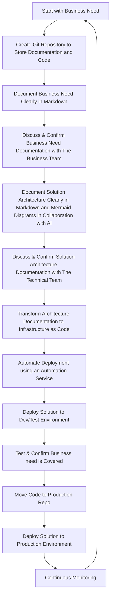

# AAA Framework: AI Aided Architecture

**Better Architecture, Faster**

[](https://opensource.org/licenses/MIT)
[](https://github.com/neverarchitectalone/framework)
[](https://neverarchitectalone.com/docs)
[](CONTRIBUTING.md)
[](https://github.com/neverarchitectalone/framework)
[](https://github.com/neverarchitectalone/framework)
[](https://github.com/neverarchitectalone/framework/issues)
[](https://github.com/neverarchitectalone/framework/pulls)

Welcome to the official repository for the **AI Aided Architecture (AAA) Framework**. This project provides a methodology for designing and building robust cloud architectures by transforming AI tools into collaborative partners.

## The Problem

Traditional architecture approaches often lead to incomplete designs, inconsistent implementations, knowledge silos, and limited validation of architectural decisions.

## The AAA Solution

The AAA Framework provides a systematic approach to leverage AI throughout the architecture process. It combines documentation-driven development, Infrastructure as Code (IaC) principles, and continuous validation to help you create better architecture, faster.

-----

## ⚠️ Critical AI Safety Warning

**IMPORTANT**: AI tools can and do hallucinate. They may confidently provide incorrect, outdated, or insecure information. The core principle of this framework is **never implement AI recommendations without human verification**.

### Key Safety Principles:

  * **Always fact-check** AI recommendations against official documentation.
  * **Validate** all technical specifications and service capabilities.
  * **Test** all generated code before production deployment.
  * **Review** AI-suggested architectures with experienced team members.

**The AAA framework enhances human expertise; it does not replace it.**

-----

## Core Principles

1. **Human-AI Collaboration**: Architects provide domain expertise and strategic vision, while AI provides pattern recognition, completeness checking, and alternative perspectives.
2. **Documentation-Driven Architecture**: All designs are documented in version-controlled Markdown and Mermaid diagrams, creating a single source of truth that is continuously updated.
3. **Infrastructure as Code (IaC) First**: Every architectural design is intended to become a deployable IaC template, ensuring reproducible and version-controlled environments.
4. **Iterative Refinement**: Architecture evolves through multiple AI-powered review cycles and continuous feedback, with all decisions documented.

## The AAA Methodology in Steps

AAA follows a systematic process from business problem to production deployment.



## Getting Started

To start your first project using the AAA Framework:

1.  **Clone the template repository** (Note: you will need to create this template repo, a common practice for frameworks).
    ```bash
    git clone https://github.com/neverarchitectalone/aaa-template.git my-new-project
    cd my-new-project
    ```
2.  **Familiarize yourself with the repository structure**, including the `docs/`, `infrastructure/`, and `scripts/` directories.
3.  **Begin by defining your business problem** in `docs/business-requirements.md` and designing your solution in `docs/architecture.md`.
4.  **Use AI collaboration sessions** to review and validate your design, documenting the sessions in the `docs/ai-sessions/` directory.

## How to Contribute

We welcome contributions to the AAA Framework\! Your help is essential for making it better.

### Types of Contributions

  * **Documentation improvements**: Fix typos, add examples, or improve clarity.
  * **Template enhancements**: Create better templates for common architectural scenarios.
  * **Tool integrations**: Suggest or implement new tools and integrations.
  * **Best practices**: Share your experiences and what you've learned implementing AAA.

### Contribution Process

1.  **Fork the repository**.
2.  **Create a feature branch**: `git checkout -b feature/your-improvement`.
3.  **Make your changes**, following the AAA standards and documenting your AI collaboration sessions.
4.  **Test your changes** thoroughly.
5.  **Submit a pull request** with a detailed description of your changes.

Please read our `CONTRIBUTING.md` file for more details on our code of conduct and the process for submitting pull requests.

## Community and Support

  * **Official Website**: [neverarchitectalone.com](https://neverarchitectalone.com)
  * **GitHub Organization**: [github.com/neverarchitectalone](https://github.com/neverarchitectalone)
  * **Community Discussions**: Join the conversation in our [GitHub Discussions](https://github.com/neverarchitectalone/community/discussions).

## License

This project is licensed under the MIT License - see the [LICENSE](LICENSE) file for details.
