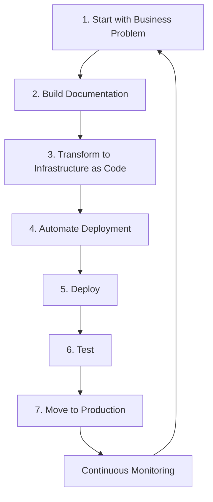
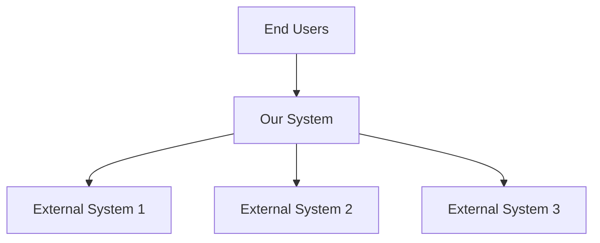
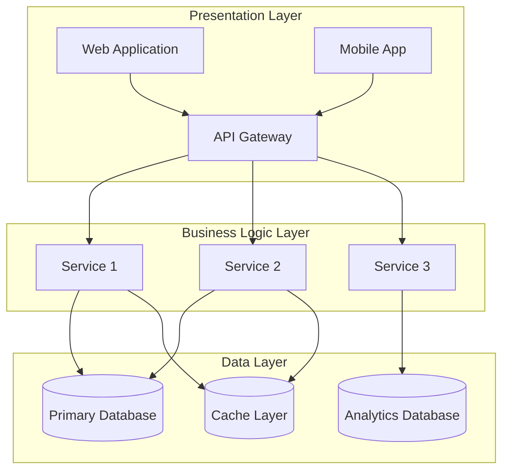
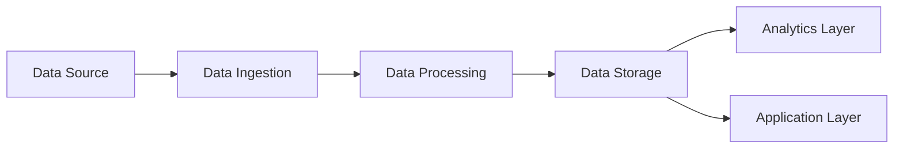
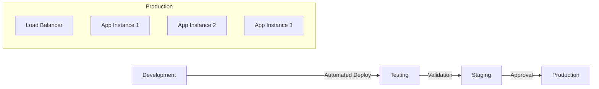

# AAA Framework Documentation
*AI Aided Architecture - Better Architecture, Faster*

**Version:** 1.0.0  
**Last Updated:** July 25, 2025  
**Maintainer:** Ahmad Obay  
**Official Website:** https://neverarchitectalone.com  
**GitHub Organization:** https://github.com/neverarchitectalone

---

## Table of Contents

1. [Introduction](#introduction)
2. [Core Principles](#core-principles)
3. [The AAA Methodology](#the-aaa-methodology)
4. [Tools and Technology Stack](#tools-and-technology-stack)
5. [Implementation Guide](#implementation-guide)
6. [Best Practices](#best-practices)
7. [Templates and Examples](#templates-and-examples)
8. [Troubleshooting](#troubleshooting)
9. [Contributing](#contributing)

---

## Introduction

### What is AAA?

**AAA (AI Aided Architecture)** is a methodology for designing and building cloud architectures in the era of AI. Instead of architecting in isolation, AAA transforms AI tools into collaborative partners, helping create more complete, robust, and future-proof solutions.

### The Problem AAA Solves

Traditional architecture approaches often result in:
- **Incomplete designs** that miss critical requirements
- **Inconsistent implementations** across teams and projects
- **Knowledge silos** where expertise isn't shared
- **Starting from scratch** with every new project
- **Limited validation** of architectural decisions
- Lack of documentation as 
- **Lack of a clear architecture & engineering process** where each organization has to re-invent the wheel with each project
- **Documentation / implementation drift** where - in the small chance where there is a documentation - the implementation starts varying from the documentation that was established at the beginning of the project as the organization continues to move forward with it is cloud & infrastructure journey.
- **Knowledge & know-how bleed** where individuals who bult the architecture leave the organization taking with them all knowledge of why certain architectural decisions were made and how they were implemented or what is required to maintain them.
- **Lack of version control** as almost all organizations relay on Word/Visio/PDF most of the time to document there infrastructure which does not lead itself easily to version control systems

### The AAA Solution

AAA provides:
- **Systematic AI collaboration** throughout the architecture process for accelerated design
- **Documentation-driven development** using Markdown and Mermaid for rapid iteration
- **Proven methodology** with clear steps and deliverables that reduce time-to-delivery
- **Reusable templates** and best practices for immediate productivity gains
- **Continuous validation** through AI-powered reviews for faster feedback cycles

### Why "Better Architecture, Faster"?

Modern cloud architectures are too complex for any single person to master completely. AAA leverages AI as a:
- **Second brain** to catch what you might miss
- **Knowledge repository** of best practices and patterns
- **Validation partner** to review and improve designs
- **Documentation assistant** to ensure completeness
- **Implementation accelerator** from design to deployment

The result: **Better Architecture, Faster** - more complete designs, validated approaches, and accelerated delivery.

### ⚠️ Critical AI Safety Warning

**IMPORTANT**: AI tools can and do hallucinate - they may confidently provide incorrect information, outdated practices, or non-existent services. **Never implement AI recommendations without verification**. The AAA framework requires human validation of all AI outputs.

**Key Safety Principles**:
- **Always fact-check** AI recommendations against official documentation
- **Validate** all technical specifications and service capabilities
- **Test** all generated code before production deployment
- **Review** AI-suggested architectures with experienced team members
- **Question** any AI recommendation that seems unusual or too good to be true

---

## Core Principles

### 1. Human-AI Collaboration Model
- **Architects provide**: Domain expertise, business context, strategic vision, and decision-making
- **AI provides**: Pattern recognition, completeness checking, best practice validation, and alternative perspectives
- **Together they create**: More robust, complete, and validated architectures

### 2. Documentation-Driven Architecture
- **Architecture as Code**: All designs documented in version-controlled Markdown that directly translates to IaC
- **Visual Clarity**: Mermaid diagrams for complex relationships and flows
- **Single Source of Truth**: All stakeholders work from the same documentation
- **Living Documentation**: Continuously updated throughout the project lifecycle
- **Executable Architecture**: Documentation structure directly maps to Infrastructure as Code templates

### 3. Infrastructure as Code First
- **Executable Architectures**: Every architectural design becomes deployable IaC templates
- **Version Controlled Infrastructure**: All infrastructure changes tracked through Git
- **Reproducible Deployments**: Consistent environments through code-defined infrastructure
- **Multi-Cloud Support**: Platform-agnostic approach using Terraform, ARM templates, CloudFormation
- **Automated Validation**: IaC templates validated against architectural specifications

### 4. Iterative Refinement
- **Multiple Review Cycles**: AI-powered validation at each stage
- **Continuous Improvement**: Architecture evolves based on feedback and validation
- **Framework Alignment**: Systematic application of well-architected principles
- **Knowledge Capture**: All decisions and rationale documented for future reference

### 5. Practical Implementation Focus
- **From Docs to Deployment**: Clear path from architecture to running infrastructure
- **Tool Integration**: Seamless workflow between design and implementation tools
- **Cross-Platform Support**: Works across Windows, Linux, and macOS environments
- **Enterprise Ready**: Scalable processes for teams and organizations

---

## AI Safety and Responsible Use

### ⚠️ Understanding AI Limitations

**AI Hallucinations**: AI tools can generate plausible-sounding but incorrect information, including:
- **Non-existent cloud services** or service features
- **Outdated pricing** or service availability information
- **Incorrect syntax** for Infrastructure as Code templates
- **Invalid configurations** that won't deploy
- **Security vulnerabilities** in suggested implementations
- **Deprecated APIs** or practices

### Mandatory Validation Process

Every AAA implementation **MUST** include these validation steps:

#### 1. Technical Fact-Checking
```markdown
## AI Output Validation Checklist
- [ ] Verify all cloud service names exist and are spelled correctly
- [ ] Check service availability in target regions
- [ ] Validate current pricing against official pricing calculators
- [ ] Confirm API versions and syntax against official documentation
- [ ] Test all generated code in development environment
- [ ] Verify security configurations follow current best practices
```

#### 2. Documentation Cross-Reference
- **Official Cloud Documentation**: Always check vendor docs (Azure, AWS, GCP)
- **Recent Updates**: AI training data may be outdated - check for recent service changes
- **Regional Availability**: Verify services are available in your target regions
- **Pricing Validation**: Use official pricing calculators, not AI estimates

#### 3. Code Validation
```bash
# Example validation process for generated Terraform
terraform validate    # Check syntax
terraform plan        # Preview changes
terraform apply -auto-approve=false  # Manual approval required

# Test scripts in isolated environment
./scripts/deploy.sh --dry-run
./scripts/validate-infrastructure.sh
```

### Red Flags - When to Be Extra Cautious

**🚨 High-Risk AI Outputs** (require immediate human review):
- Security configurations and access policies
- Network configurations and firewall rules
- Database schemas and data migration scripts
- Backup and disaster recovery procedures
- Cost-sensitive resource configurations
- Production deployment procedures

**🚨 AI Confidence Indicators** (be skeptical of):
- AI responses that seem overly confident about complex topics
- Recommendations without trade-offs or alternatives mentioned
- Detailed technical information without references
- Solutions that seem "too perfect" for your specific use case

### Best Practices for AI Collaboration

#### ⚠️ Safety First: Never Trust, Always Verify

**Golden Rule**: Treat AI as a knowledgeable colleague who might be wrong about details. Always fact-check recommendations against authoritative sources.

#### Effective Prompting Strategies

**Architecture Review Prompts**:
```markdown
## System Prompt for Architecture Reviews
You are an expert cloud architect reviewing this system design. Please analyze:
1. Completeness - Are any critical components missing?
2. Scalability - Can this handle the specified load?
3. Security - What are the potential security vulnerabilities?
4. Cost - Are there opportunities for cost optimization?
5. Well-Architected Principles - How well does this align with cloud best practices?

IMPORTANT: Please provide specific, actionable recommendations with rationale.
When suggesting specific services or configurations, please note that I will 
need to verify these against current official documentation before implementation.
```

**Implementation Guidance Prompts**:
```markdown
## System Prompt for Implementation
You are helping convert this architecture design into deployable code. Please:
1. Generate Infrastructure as Code templates
2. Create deployment scripts with error handling
3. Suggest testing strategies
4. Identify potential deployment issues
5. Recommend monitoring and observability setup

Focus on practical, production-ready implementations.
REMINDER: All generated code and configurations will be validated against 
official documentation and tested in development before production use.
```

#### Validation-First AI Collaboration

**Step 1: Get AI Recommendations**
```markdown
**Human**: I need to design a highly available database solution for 10,000 concurrent users.

**AI Response**: [AI provides recommendations]

**Human**: Thank you. Before I implement this, I need to verify:
1. Are these Azure SQL Database service tiers still current?
2. What's the current pricing for these configurations?
3. Can you point me to official documentation I should review?
```

**Step 2: Immediate Fact-Checking**
- Cross-reference service names and features with official cloud provider documentation
- Verify pricing using official pricing calculators
- Check service availability in target regions
- Validate API syntax and versions

**Step 3: Document Validation Process**
```markdown
## Validation Log
**AI Recommendation**: Use Azure SQL Database Premium P2 tier
**Verification Date**: 2025-01-25
**Sources Checked**: 
- Azure SQL Database pricing page: [URL]
- Service tier documentation: [URL]
**Validation Results**: 
- ✅ Service tier exists and is correctly named
- ✅ Pricing verified via Azure calculator
- ⚠️  Performance specs need to be validated with load testing
**Decision**: Proceed with recommendation, plan load testing
```

#### Session Documentation

**AI Session Template** (Updated with Safety Requirements):
```markdown
# AI Collaboration Session: [Topic]

**Date**: YYYY-MM-DD  
**Duration**: [Minutes]  
**AI Tool**: [Claude/ChatGPT/etc.]  
**Session Type**: [Design Review/Implementation/Problem Solving]  

## Context
[Brief description of what you're working on]

## Questions Asked
1. [Question 1]
2. [Question 2]

## AI Recommendations (Unvalidated)
- [Recommendation 1 with rationale]
- [Recommendation 2 with rationale]
- [Recommendation 3 with rationale]

## ⚠️ VALIDATION REQUIRED
**Note**: All AI recommendations require fact-checking before implementation

## Validation Process
### [Recommendation 1]
- **Verification Date**: [Date]
- **Sources Checked**: [Official documentation links]
- **Validation Result**: [✅ Verified / ❌ Incorrect / ⚠️ Partially correct]
- **Notes**: [Any corrections or clarifications needed]

### [Recommendation 2]
- **Verification Date**: [Date]
- **Sources Checked**: [Official documentation links]
- **Validation Result**: [✅ Verified / ❌ Incorrect / ⚠️ Partially correct]
- **Notes**: [Any corrections or clarifications needed]

## Final Decisions
- [✅] Decision 1 - Accepted after validation
- [❌] Decision 2 - Rejected due to [specific factual error found]
- [🔄] Decision 3 - Modified based on fact-checking results

## Action Items
- [ ] Task 1 - Assigned to [person] - Due [date] - **Requires validation**
- [ ] Task 2 - Assigned to [person] - Due [date] - **Pre-validated**

## Follow-up Required
- [Fact-checking needed for specific items]
- [Next validation session needed]

## Files Updated
- `docs/architecture.md` - Added validated security section
- `infrastructure/terraform/main.tf` - Updated with verified resource types

## Lessons Learned
- [What AI got wrong and how we caught it]
- [What AI got right and saved us time]
- [Improvements for future AI collaboration]
```

### Common AI Errors in Architecture

#### Infrastructure Misconfigurations
- **Incorrect Resource Names**: AI may suggest non-existent SKUs or instance types
- **Invalid Network Configurations**: Subnet ranges that conflict or don't work
- **Deprecated APIs**: AI may reference older API versions
- **Incorrect Pricing Models**: Outdated or incorrect cost estimates

#### Security Vulnerabilities
- **Overly Permissive Policies**: AI may suggest broad access policies for simplicity
- **Outdated Security Practices**: Security recommendations may not reflect current threats
- **Missing Security Layers**: AI might focus on functionality over security depth

#### Performance Assumptions
- **Incorrect Performance Characteristics**: AI may misstate service limits or capabilities
- **Scaling Assumptions**: Incorrect auto-scaling configurations
- **Resource Sizing**: Over or under-provisioning based on outdated information

---

## The AAA Methodology

### Overview: 7-Step Process

AAA follows a systematic 7-step methodology that takes you from business problem to production deployment:



### Step 1: Start with a Business Problem

**Objective**: Clearly define what we're trying to solve and establish success criteria.

**Activities**:
- Define the business problem in clear, measurable terms
- Identify stakeholders and their requirements
- Establish success criteria and constraints
- Gather functional and non-functional requirements

**AI Collaboration**:
- Use AI to help identify missing requirements
- Validate problem definition against industry patterns
- Explore alternative approaches and solutions
- Generate comprehensive requirement checklists

**Deliverables**:
- Business problem statement
- Requirements documentation
- Success criteria definition
- Stakeholder analysis

**Template**: [Business Problem Template](#business-problem-template)

### Step 2: Build the Documentation

**Objective**: Create comprehensive architectural documentation using Markdown and Mermaid.

**Activities**:
- Design high-level architecture using Mermaid diagrams
- Document each component and its responsibilities
- Define data flows and integration points
- Specify security, performance, and operational requirements

**AI Collaboration**:
- Review architecture for completeness and best practices
- Suggest improvements and alternative approaches
- Validate against well-architected framework principles
- Generate detailed component specifications

**Deliverables**:
- `architecture.md` with complete system design
- Mermaid diagrams for system overview, data flows, and deployment
- Component specifications and interface definitions
- Security and operational requirements

**Template**: [Architecture Documentation Template](#architecture-documentation-template)

### Step 3: Transform to Infrastructure as Code (Transform to Infrastructure as Code)

**Objective**: Transform architectural documentation into executable Infrastructure as Code templates and deployable automation.

**Activities**:
- Convert architecture diagrams to Infrastructure as Code (Terraform, ARM templates, CloudFormation)
- Create deployment scripts (Bash/PowerShell) based on documented requirements
- Generate configuration files and parameter templates aligned with architecture specifications
- Build validation and testing scripts that verify IaC against architectural design
- Establish CI/CD pipelines that deploy infrastructure from code

**AI Collaboration**:
- Generate IaC templates directly from architectural specifications and Mermaid diagrams
- Create deployment scripts with comprehensive error handling and validation
- Suggest optimization patterns and infrastructure best practices
- Generate comprehensive testing strategies for infrastructure validation
- Review IaC code for security, performance, and cost optimization

**Deliverables**:
- Infrastructure as Code templates (Terraform, ARM templates, CloudFormation) matching architectural design
- Platform-specific deployment scripts with proper error handling
- Configuration templates and environment-specific parameter files
- Infrastructure validation and testing scripts
- CI/CD pipeline definitions for automated deployment

**Template**: [Infrastructure as Code Template](#infrastructure-code-template)

### Step 4: Automate the Deployment

**Objective**: Create repeatable, reliable deployment processes with proper CI/CD integration.

**Activities**:
- Set up CI/CD pipelines for automated deployment
- Implement infrastructure validation and testing
- Configure monitoring and alerting
- Create rollback and disaster recovery procedures

**AI Collaboration**:
- Generate CI/CD pipeline configurations
- Create comprehensive testing strategies
- Suggest monitoring and alerting configurations
- Design rollback and recovery procedures

**Deliverables**:
- CI/CD pipeline definitions
- Automated testing suites
- Monitoring and alerting configurations
- Deployment and rollback procedures

### Step 5: Deploy

**Objective**: Execute the deployment process and validate successful implementation.

**Activities**:
- Deploy to development/staging environments first
- Execute validation tests and health checks
- Verify functionality against requirements
- Document any issues or deviations

**AI Collaboration**:
- Assist with troubleshooting deployment issues
- Validate deployment against architectural specifications
- Suggest optimizations based on deployment results
- Help document lessons learned

**Deliverables**:
- Successfully deployed infrastructure
- Deployment validation reports
- Issue documentation and resolutions
- Performance baseline measurements

### Step 6: Test

**Objective**: Comprehensively validate the deployed solution against all requirements.

**Activities**:
- Execute functional testing suites
- Perform security testing and validation
- Conduct performance and load testing
- Validate disaster recovery and backup procedures

**AI Collaboration**:
- Generate comprehensive test cases
- Analyze test results and suggest improvements
- Identify potential failure modes and edge cases
- Create performance optimization recommendations

**Deliverables**:
- Test execution reports
- Security assessment results
- Performance testing outcomes
- Validated disaster recovery procedures

### Step 7: Move to Production

**Objective**: Successfully transition the solution to production with proper monitoring and support.

**Activities**:
- Execute production deployment
- Implement monitoring and alerting
- Establish operational procedures
- Train support teams and create documentation

**AI Collaboration**:
- Validate production readiness
- Generate operational runbooks and procedures
- Create troubleshooting guides
- Establish performance monitoring baselines

**Deliverables**:
- Production-deployed solution
- Operational runbooks and procedures
- Monitoring and alerting setup
- Support documentation and training materials

---

## Tools and Technology Stack

### Primary Tools

#### Cursor IDE + Claude Code
- **Purpose**: Development environment with integrated AI collaboration
- **Why**: Seamless AI collaboration during coding and documentation
- **Setup**: [Cursor Setup Guide](#cursor-setup-guide)

#### Markdown
- **Purpose**: Documentation format for all architectural specifications
- **Why**: Version controllable, readable, widely supported
- **Best Practices**: [Markdown Guidelines](#markdown-guidelines)

#### Mermaid
- **Purpose**: Diagram-as-code for architectural visualizations
- **Why**: Version controllable diagrams that stay in sync with documentation
- **Examples**: [Mermaid Diagram Library](#mermaid-diagram-library)

### Development Environment Options

#### Recommended Setup: Cross-Platform
```bash
# Core tools installation
curl -fsSL https://get.docker.com -o get-docker.sh
sh get-docker.sh

# Install Cursor IDE
# Download from: https://cursor.sh

# Install PowerShell Core (cross-platform)
# Instructions: https://docs.microsoft.com/powershell/scripting/install

# Install Cloud CLIs
# Azure CLI: https://docs.microsoft.com/cli/azure/install-azure-cli
# AWS CLI: https://aws.amazon.com/cli/
# Google Cloud CLI: https://cloud.google.com/sdk/docs/install
```

#### Platform-Specific Considerations

**Linux (Ubuntu/Debian)**:
```bash
# Essential tools
sudo apt-get update && sudo apt-get install -y \
  git curl wget jq yq docker.io docker-compose \
  python3-pip nodejs npm

# PowerShell Core for cross-platform support
wget -q https://packages.microsoft.com/config/ubuntu/20.04/packages-microsoft-prod.deb
sudo dpkg -i packages-microsoft-prod.deb
sudo apt-get update && sudo apt-get install -y powershell
```

**Windows**:
```powershell
# Using Chocolatey
Set-ExecutionPolicy Bypass -Scope Process -Force
iex ((New-Object System.Net.WebClient).DownloadString('https://chocolatey.org/install.ps1'))

choco install -y git vscode docker-desktop nodejs python3 jq terraform azure-cli awscli
```

**macOS**:
```bash
# Using Homebrew
/bin/bash -c "$(curl -fsSL https://raw.githubusercontent.com/Homebrew/install/HEAD/install.sh)"

brew install git docker nodejs python3 jq terraform azure-cli awscli
brew install --cask cursor docker
```

### Repository Structure

Every AAA project follows this standardized structure:

```
project-name/
├── AAA-FRAMEWORK.md             # REQUIRED: Framework version & guidance
├── README.md                    # Project overview and quick start
├── docs/
│   ├── architecture.md          # Main architectural documentation
│   ├── business-requirements.md # Business problem and requirements
│   ├── ai-sessions/            # AI collaboration session logs
│   │   ├── 20250125-initial-design.md
│   │   ├── 20250130-security-review.md
│   │   └── ...
│   ├── diagrams/               # Mermaid diagram sources
│   │   ├── system-overview.mmd
│   │   ├── data-flow.mmd
│   │   └── deployment.mmd
│   ├── decisions/              # Architecture Decision Records (ADRs)
│   └── troubleshooting.md      # Common issues and solutions
├── infrastructure/             # Infrastructure as Code (IaC) templates
│   ├── terraform/              # Terraform configurations
│   │   ├── main.tf
│   │   ├── variables.tf
│   │   ├── outputs.tf
│   │   └── modules/
│   ├── arm-templates/          # Azure Resource Manager templates
│   ├── cloudformation/         # AWS CloudFormation templates
│   └── parameters/             # Environment-specific parameters
│       ├── dev.json
│       ├── staging.json
│       └── prod.json
├── scripts/
│   ├── bash/                   # Linux/Unix deployment scripts
│   │   ├── deploy.sh
│   │   ├── validate.sh
│   │   └── cleanup.sh
│   ├── powershell/             # Windows/Cross-platform scripts
│   │   ├── Deploy-Infrastructure.ps1
│   │   ├── Test-Deployment.ps1
│   │   └── Remove-Resources.ps1
│   ├── shared/                 # Cross-platform utilities
│   └── templates/              # Script templates
├── tests/
│   ├── unit/                  # Unit tests for scripts
│   ├── integration/           # Integration tests
│   ├── security/             # Security validation tests
│   └── performance/          # Performance and load tests
├── .github/workflows/        # GitHub Actions (or equivalent CI/CD)
├── .gitignore
├── .gitattributes           # Line ending management
└── .editorconfig            # Consistent code formatting
```

---

## Implementation Guide

### Getting Started with AAA

#### Step 1: Environment Setup

1. **Install Required Tools**:
   - Cursor IDE with Claude Code integration
   - Git with proper configuration
   - Docker for containerization
   - Cloud CLI tools (Azure, AWS, GCP as needed)

2. **Configure Development Environment**:
   ```bash
   # Clone AAA template repository
   git clone https://github.com/neverarchitectalone/aaa-template.git my-project
   cd my-project
   
   # Initialize for your project
   ./scripts/initialize-project.sh
   ```

3. **Set Up Git Configuration**:
   ```bash
   # Essential AAA Git configuration
   git config --global core.autocrlf false
   git config --global core.eol lf
   git config --global init.defaultBranch main
   
   # AAA-specific aliases
   git config --global alias.aaa-log "log --oneline --grep='AAA:'"
   git config --global alias.ai-sessions "log --oneline --grep='AI-Session:'"
   ```

#### Step 2: Create Your First AAA Project

1. **Define the Business Problem**:
   ```markdown
   # Business Problem Definition
   
   ## Problem Statement
   [Clear description of what business problem you're solving]
   
   ## Success Criteria
   - [Measurable success criterion 1]
   - [Measurable success criterion 2]
   
   ## Constraints
   - [Technical constraint 1]
   - [Business constraint 1]
   ```

2. **Start AI Collaboration Session**:
   - Open Cursor IDE with Claude Code
   - Begin documenting your architecture in `docs/architecture.md`
   - Use AI to validate completeness and suggest improvements

3. **Create Architecture Documentation**:
   Follow the [Architecture Documentation Template](#architecture-documentation-template)

#### Step 3: AI Collaboration Best Practices

**Effective AI Prompting for Architecture**:

```markdown
## Example AI Collaboration Session

**Human**: I'm designing a microservices architecture for an e-commerce platform that needs to handle 10,000 concurrent users. Can you review my current design and suggest improvements?

**AI Response**: [AI provides detailed analysis and suggestions]

**Human**: Based on your feedback, I'm updating the database strategy to include read replicas. Can you help me design the data synchronization approach?

**AI Response**: [AI provides specific implementation guidance]
```

**Document AI Sessions**:
```markdown
# AI Session Log: Security Review
**Date**: 2025-01-25  
**Duration**: 45 minutes  
**Participants**: [Your Name], Claude AI  

## Key Questions Asked
1. How should we implement zero-trust security?
2. What are the potential security vulnerabilities in our current design?

## AI Recommendations
- Implement API gateway with OAuth 2.0
- Add network segmentation between microservices
- Use Azure Key Vault for secrets management

## Implementation Decisions
- [✅] Implement API gateway - Priority 1
- [🔄] Network segmentation - In progress
- [⏳] Key Vault integration - Planned for Sprint 3

## Next Steps
- Update architecture diagram with security components
- Create security testing procedures
- Schedule follow-up AI session for security validation
```

---

## Best Practices

### Git Workflow Best Practices

#### Branch Strategy
```bash
# Main branches
main                    # Production-ready code
develop                # Integration branch

# Feature branches
feature/auth-service   # New features
architecture/security  # Architecture updates
ai-session/performance # AI collaboration results
docs/api-specification # Documentation updates
hotfix/critical-bug    # Emergency fixes
```

#### Commit Message Convention
```bash
# Format: type(scope): description

# Examples:
git commit -m "feat(auth): add OAuth 2.0 implementation"
git commit -m "docs(architecture): update security section with AI feedback"
git commit -m "ai-session(performance): record load testing recommendations"
git commit -m "fix(deployment): resolve container startup issues"
git commit -m "infra(terraform): add monitoring resources"
```

#### AAA-Specific Git Aliases
```bash
# Add to your .gitconfig
[alias]
    aaa-init = "!f() { \
        git checkout -b architecture/initial-design; \
        mkdir -p docs/{ai-sessions,diagrams,decisions}; \
        mkdir -p {infrastructure,scripts/{bash,powershell},tests}; \
        touch AAA-FRAMEWORK.md docs/architecture.md; \
        echo 'AAA project initialized'; \
    }; f"
    
    ai-session = "!f() { \
        session_file=\"docs/ai-sessions/$(date +%Y%m%d-%H%M%S)-$1.md\"; \
        touch \"$session_file\"; \
        echo \"AI session created: $session_file\"; \
    }; f"
    
    aaa-status = "!git log --oneline --grep='AAA:' --grep='ai-session:' --grep='docs(' --since='1 week ago'"
```

### Testing and Validation

#### Architecture Validation Checklist

```markdown
## Pre-Deployment Architecture Review

### Completeness Check
- [ ] All business requirements addressed
- [ ] Non-functional requirements specified
- [ ] Security requirements documented
- [ ] Performance requirements defined
- [ ] Disaster recovery plan created

### Well-Architected Framework Alignment
- [ ] **Security**: Identity, data protection, infrastructure protection
- [ ] **Reliability**: Fault tolerance, backup and recovery, monitoring
- [ ] **Performance**: Compute, storage, network, database optimization
- [ ] **Cost**: Resource optimization, cost monitoring, lifecycle management
- [ ] **Operational Excellence**: Automation, monitoring, incident response

### AI Validation
- [ ] Architecture reviewed by AI tool
- [ ] Alternative approaches considered
- [ ] Best practices validated
- [ ] Common pitfalls identified and addressed
- [ ] Implementation roadmap validated
```

#### Testing Strategy

**Infrastructure Testing**:
```bash
# Validation script example
#!/bin/bash
# File: scripts/validate-architecture.sh

echo "🏗️  Validating AAA Architecture Implementation"

# Test 1: Repository structure
echo "✅ Checking repository structure..."
required_files=(
    "AAA-FRAMEWORK.md"
    "docs/architecture.md"
    "scripts/deploy.sh"
    ".gitattributes"
)

for file in "${required_files[@]}"; do
    if [[ ! -f "$file" ]]; then
        echo "❌ Missing required file: $file"
        exit 1
    fi
done

# Test 2: Documentation completeness
echo "✅ Validating documentation..."
required_sections=(
    "## Architecture Overview"
    "## Security"
    "## Performance"
    "## Cost Considerations"
)

for section in "${required_sections[@]}"; do
    if ! grep -q "$section" docs/architecture.md; then
        echo "❌ Missing documentation section: $section"
        exit 1
    fi
done

# Test 3: Mermaid diagram validation
echo "✅ Validating diagrams..."
if command -v mermaid >/dev/null 2>&1; then
    find docs/diagrams -name "*.mmd" -exec mermaid --validate {} \;
else
    echo "⚠️  Mermaid CLI not found, skipping diagram validation"
fi

echo "🎉 Architecture validation completed successfully!"
```

---

## Templates and Examples

### Business Problem Template

```markdown
# Business Problem Definition

## Project Information
- **Project Name**: [Your Project Name]
- **Stakeholder**: [Primary Business Stakeholder]
- **Technical Lead**: [Technical Lead Name]
- **Target Go-Live**: [YYYY-MM-DD]

## Problem Statement

### Current State
[Describe the current situation, pain points, and limitations]

### Desired Future State
[Describe what success looks like]

### Gap Analysis
[What needs to change to get from current to future state]

## Business Requirements

### Functional Requirements
1. [Requirement 1 with acceptance criteria]
2. [Requirement 2 with acceptance criteria]
3. [Requirement 3 with acceptance criteria]

### Non-Functional Requirements

#### Performance
- **Concurrent Users**: [Number] users
- **Response Time**: [Time] for [specific operations]
- **Throughput**: [Transactions/requests] per [time period]
- **Availability**: [Percentage] uptime

#### Security
- **Authentication**: [Requirements]
- **Authorization**: [Requirements]
- **Data Protection**: [Requirements]
- **Compliance**: [Standards/regulations]

#### Scalability
- **Growth Projections**: [Expected growth over time]
- **Scaling Strategy**: [Horizontal/vertical/both]
- **Geographic Distribution**: [Regions/countries]

### Business Constraints

#### Budget
- **Development Budget**: [Amount]
- **Operational Budget**: [Monthly/yearly]
- **Timeline Constraints**: [Fixed dates/milestones]

#### Technical Constraints
- **Existing Systems**: [Systems that must be integrated]
- **Technology Preferences**: [Required/preferred technologies]
- **Resource Constraints**: [Team size/skills limitations]

## Success Criteria

### Quantitative Metrics
- [Measurable success criterion 1]
- [Measurable success criterion 2]
- [Measurable success criterion 3]

### Qualitative Goals
- [Qualitative success criterion 1]
- [Qualitative success criterion 2]

## Risk Assessment

### High-Risk Items
1. **[Risk Name]**: [Description] - **Mitigation**: [Strategy]
2. **[Risk Name]**: [Description] - **Mitigation**: [Strategy]

### Dependencies
- [External dependency 1]
- [External dependency 2]

## AI Collaboration Notes

### Questions for AI Review
1. Are there any common requirements I might have missed?
2. What are typical challenges for this type of project?
3. What architectural patterns work best for these requirements?

### AI Recommendations
[Document AI feedback on requirements completeness and suggestions]
```

### Architecture Documentation Template

```markdown
# Architecture Documentation

## Project Overview
- **Project Name**: [Your Project Name]
- **Version**: 1.0.0
- **Last Updated**: [YYYY-MM-DD]
- **Architect**: [Your Name]
- **AI Collaboration**: [AI tool used and sessions completed]

## Executive Summary
[2-3 paragraph summary of the architecture for executive audiences]

## Architecture Overview

### System Context


### High-Level Architecture


## Component Architecture

### [Component Name 1]
- **Purpose**: [What this component does]
- **Technology**: [Tech stack used]
- **Responsibilities**: 
  - [Responsibility 1]
  - [Responsibility 2]
- **Interfaces**: [APIs, events, data contracts]
- **Dependencies**: [What this depends on]

### [Component Name 2]
- **Purpose**: [What this component does]
- **Technology**: [Tech stack used]
- **Responsibilities**: 
  - [Responsibility 1]
  - [Responsibility 2]
- **Interfaces**: [APIs, events, data contracts]
- **Dependencies**: [What this depends on]

## Data Architecture

### Data Flow Diagram


### Data Models
[Key data entities and their relationships]

### Data Storage Strategy
- **Primary Storage**: [Database choice and rationale]
- **Caching Strategy**: [Caching approach]
- **Data Archival**: [Long-term storage strategy]
- **Backup and Recovery**: [Backup strategy]

## Security Architecture

### Security Principles
- [Security principle 1]
- [Security principle 2]
- [Security principle 3]

### Authentication and Authorization
- **Authentication Method**: [OAuth, SAML, etc.]
- **Authorization Model**: [RBAC, ABAC, etc.]
- **Identity Provider**: [Azure AD, Auth0, etc.]

### Data Protection
- **Encryption at Rest**: [Strategy and implementation]
- **Encryption in Transit**: [TLS configuration]
- **Key Management**: [Key management solution]
- **Data Classification**: [Sensitive data handling]

### Network Security
- **Network Segmentation**: [Network design]
- **Firewall Rules**: [Access control]
- **VPN/Private Connectivity**: [Secure access]

## Performance and Scalability

### Performance Requirements
- **Response Time**: [Target response times]
- **Throughput**: [Requests per second]
- **Concurrent Users**: [Maximum concurrent load]

### Scalability Strategy
- **Horizontal Scaling**: [How components scale out]
- **Vertical Scaling**: [When and how to scale up]
- **Auto-scaling Rules**: [Scaling triggers and policies]

### Performance Optimizations
- **Caching Strategy**: [What, where, and how to cache]
- **Database Optimization**: [Indexing, partitioning, etc.]
- **CDN Strategy**: [Content delivery optimization]

## Reliability and Availability

### Availability Requirements
- **Target SLA**: [Uptime percentage]
- **Acceptable Downtime**: [Planned and unplanned]
- **Recovery Time Objective (RTO)**: [Maximum downtime]
- **Recovery Point Objective (RPO)**: [Maximum data loss]

### Fault Tolerance
- **Single Points of Failure**: [How eliminated]
- **Redundancy Strategy**: [Redundant components]
- **Circuit Breakers**: [Failure isolation]
- **Bulkhead Patterns**: [Resource isolation]

### Disaster Recovery
- **Backup Strategy**: [What, when, where]
- **Recovery Procedures**: [Step-by-step recovery]
- **Cross-Region Strategy**: [Multi-region deployment]

## Operational Excellence

### Monitoring and Observability
- **Application Monitoring**: [APM solution]
- **Infrastructure Monitoring**: [Infrastructure monitoring]
- **Log Management**: [Centralized logging]
- **Distributed Tracing**: [Request tracing]

### DevOps and CI/CD
- **Source Control**: [Git strategy]
- **Build Pipeline**: [CI/CD implementation]
- **Deployment Strategy**: [Blue-green, rolling, etc.]
- **Environment Management**: [Dev/test/prod environments]

### Incident Response
- **Alerting Strategy**: [When and how to alert]
- **Escalation Procedures**: [Who to notify when]
- **Runbooks**: [Standard operating procedures]

## Cost Considerations

### Cost Optimization Strategy
- **Resource Right-sizing**: [Optimization approach]
- **Reserved Capacity**: [Long-term cost savings]
- **Auto-scaling**: [Cost-aware scaling]
- **Storage Optimization**: [Storage tier strategy]

### Cost Monitoring
- **Budget Alerts**: [Cost monitoring setup]
- **Cost Allocation**: [How costs are tracked]
- **Regular Reviews**: [Cost review process]

## Deployment Architecture

### Environment Strategy


### Infrastructure as Code
- **Tool Choice**: [Terraform, ARM, CloudFormation]
- **State Management**: [How state is managed]
- **Environment Promotion**: [How changes move through environments]

## AI Collaboration Summary

### AI Sessions Conducted
1. **[Date] - Initial Architecture Review**: [Key outcomes]
2. **[Date] - Security Deep Dive**: [Key outcomes]
3. **[Date] - Performance Optimization**: [Key outcomes]

### Key AI Recommendations Implemented
- [Recommendation 1 and its impact]
- [Recommendation 2 and its impact]
- [Recommendation 3 and its impact]

### Architecture Validation
- **Completeness Check**: ✅ All major areas covered
- **Best Practices**: ✅ Industry standards followed
- **Well-Architected Framework**: ✅ All pillars addressed
- **Risk Assessment**: ✅ Major risks identified and mitigated

## Decision Log

### Architecture Decision Records (ADRs)
1. **[ADR-001] Database Choice**: [Decision and rationale]
2. **[ADR-002] Authentication Strategy**: [Decision and rationale]
3. **[ADR-003] Caching Approach**: [Decision and rationale]

## Implementation Roadmap

### Phase 1: Foundation (Weeks 1-4)
- [ ] Set up development environment
- [ ] Implement core infrastructure
- [ ] Basic CI/CD pipeline

### Phase 2: Core Features (Weeks 5-8)
- [ ] Authentication and authorization
- [ ] Core business logic
- [ ] Data layer implementation

### Phase 3: Advanced Features (Weeks 9-12)
- [ ] Performance optimization
- [ ] Advanced security features
- [ ] Monitoring and observability

### Phase 4: Production Readiness (Weeks 13-16)
- [ ] Load testing and optimization
- [ ] Security testing
- [ ] Production deployment

## Appendices

### A. Glossary
[Technical terms and their definitions]

### B. References
- [Industry standards referenced]
- [Documentation and resources consulted]
- [AI collaboration session details]

### C. Assumptions and Dependencies
[Key assumptions made and external dependencies]
```

### Infrastructure as Code Template

```hcl
# infrastructure/terraform/main.tf
# Generated from AAA (AI Aided Architecture) Documentation
# Last updated: [Date]
# AI Collaboration: Architecture reviewed and validated

terraform {
  required_version = ">= 1.0"
  required_providers {
    azurerm = {
      source  = "hashicorp/azurerm"
      version = ">= 3.0"
    }
  }
  
  backend "azurerm" {
    # Backend configuration
  }
}

provider "azurerm" {
  features {}
}

# Resource Group
resource "azurerm_resource_group" "main" {
  name     = var.resource_group_name
  location = var.location
  
  tags = local.common_tags
}

# Virtual Network
resource "azurerm_virtual_network" "main" {
  name                = "${var.project_name}-vnet"
  address_space       = [var.vnet_address_space]
  location            = azurerm_resource_group.main.location
  resource_group_name = azurerm_resource_group.main.name
  
  tags = local.common_tags
}

# Subnets
resource "azurerm_subnet" "app" {
  name                 = "app-subnet"
  resource_group_name  = azurerm_resource_group.main.name
  virtual_network_name = azurerm_virtual_network.main.name
  address_prefixes     = [var.app_subnet_address_prefix]
}

resource "azurerm_subnet" "data" {
  name                 = "data-subnet"
  resource_group_name  = azurerm_resource_group.main.name
  virtual_network_name = azurerm_virtual_network.main.name
  address_prefixes     = [var.data_subnet_address_prefix]
}

# Application Insights
resource "azurerm_application_insights" "main" {
  name                = "${var.project_name}-ai"
  location            = azurerm_resource_group.main.location
  resource_group_name = azurerm_resource_group.main.name
  application_type    = "web"
  
  tags = local.common_tags
}

# Key Vault
resource "azurerm_key_vault" "main" {
  name                = "${var.project_name}-kv-${random_string.suffix.result}"
  location            = azurerm_resource_group.main.location
  resource_group_name = azurerm_resource_group.main.name
  tenant_id           = data.azurerm_client_config.current.tenant_id
  
  sku_name = var.key_vault_sku
  
  access_policy {
    tenant_id = data.azurerm_client_config.current.tenant_id
    object_id = data.azurerm_client_config.current.object_id
    
    key_permissions = [
      "Get", "List", "Update", "Create", "Import", "Delete", "Recover",
      "Backup", "Restore"
    ]
    
    secret_permissions = [
      "Get", "List", "Set", "Delete", "Recover", "Backup", "Restore"
    ]
  }
  
  tags = local.common_tags
}

# Random string for unique naming
resource "random_string" "suffix" {
  length  = 4
  special = false
  upper   = false
}

# Data sources
data "azurerm_client_config" "current" {}

# Local values
locals {
  common_tags = {
    Environment = var.environment
    Project     = var.project_name
    ManagedBy   = "AAA-Framework"
    CreatedBy   = "Terraform"
  }
}
```

```hcl
# infrastructure/terraform/variables.tf

variable "project_name" {
  description = "Name of the project"
  type        = string
  validation {
    condition     = can(regex("^[a-zA-Z0-9-]+$", var.project_name))
    error_message = "Project name must contain only alphanumeric characters and hyphens."
  }
}

variable "environment" {
  description = "Environment name"
  type        = string
  validation {
    condition     = contains(["dev", "staging", "prod"], var.environment)
    error_message = "Environment must be dev, staging, or prod."
  }
}

variable "location" {
  description = "Azure region"
  type        = string
  default     = "East US"
}

variable "resource_group_name" {
  description = "Name of the resource group"
  type        = string
}

variable "vnet_address_space" {
  description = "Address space for the virtual network"
  type        = string
  default     = "10.0.0.0/16"
}

variable "app_subnet_address_prefix" {
  description = "Address prefix for the application subnet"
  type        = string
  default     = "10.0.1.0/24"
}

variable "data_subnet_address_prefix" {
  description = "Address prefix for the data subnet"
  type        = string
  default     = "10.0.2.0/24"
}

variable "key_vault_sku" {
  description = "SKU for the Key Vault"
  type        = string
  default     = "standard"
}
```

```powershell
# scripts/powershell/Deploy-Infrastructure.ps1
# AAA Framework (AI Aided Architecture) Deployment Script
# Generated from architecture documentation

#Requires -Version 7.0
#Requires -Modules Az.Accounts, Az.Resources

<#
.SYNOPSIS
    Deploy infrastructure using AAA methodology (AI Aided Architecture)
.DESCRIPTION
    This script deploys the infrastructure defined in the architecture documentation.
    It follows AAA best practices for error handling, logging, and AI collaboration tracking.
.PARAMETER Environment
    Target environment (dev, staging, prod)
.PARAMETER Location
    Azure region for deployment
.EXAMPLE
    .\Deploy-Infrastructure.ps1 -Environment dev -Location "East US"
#>

[CmdletBinding(SupportsShouldProcess)]
param(
    [Parameter(Mandatory = $true)]
    [ValidateSet('dev', 'staging', 'prod')]
    [string]$Environment,
    
    [Parameter(Mandatory = $false)]
    [string]$Location = 'East US'
)

# Import required modules
$requiredModules = @('Az.Accounts', 'Az.Resources')
foreach ($module in $requiredModules) {
    if (-not (Get-Module -Name $module -ListAvailable)) {
        throw "Required module not found: $module"
    }
    Import-Module -Name $module -Force
}

# Initialize deployment
$deploymentName = "AAA-$Environment-$(Get-Date -Format 'yyyyMMdd-HHmmss')"
$resourceGroupName = "rg-aaa-$Environment"

Write-Host "🚀 Starting AAA Infrastructure Deployment" -ForegroundColor Green
Write-Host "Environment: $Environment" -ForegroundColor Yellow
Write-Host "Location: $Location" -ForegroundColor Yellow
Write-Host "Deployment: $deploymentName" -ForegroundColor Yellow

try {
    # Ensure we're connected to Azure
    $context = Get-AzContext
    if (-not $context) {
        Write-Host "Connecting to Azure..." -ForegroundColor Yellow
        Connect-AzAccount
    }
    
    # Deploy using Terraform
    Set-Location -Path "$PSScriptRoot/../../infrastructure/terraform"
    
    Write-Host "🏗️  Initializing Terraform..." -ForegroundColor Yellow
    & terraform init
    
    Write-Host "📋 Planning deployment..." -ForegroundColor Yellow
    & terraform plan -var="environment=$Environment" -var="location=$Location" -var="resource_group_name=$resourceGroupName"
    
    if ($PSCmdlet.ShouldProcess($resourceGroupName, "Deploy Infrastructure")) {
        Write-Host "🚀 Applying infrastructure..." -ForegroundColor Yellow
        & terraform apply -auto-approve -var="environment=$Environment" -var="location=$Location" -var="resource_group_name=$resourceGroupName"
    }
    
    Write-Host "✅ Deployment completed successfully!" -ForegroundColor Green
    
    # Record AI collaboration opportunity
    Write-Host "💡 Consider running AI validation on the deployed infrastructure" -ForegroundColor Cyan
    
} catch {
    Write-Error "❌ Deployment failed: $($_.Exception.Message)"
    throw
}
```

---

## Troubleshooting

### Common Issues and Solutions

#### Issue: AI Hallucination Detection
**Symptoms**: AI provides confident but incorrect information
**Examples**: 
- Non-existent cloud services or features
- Incorrect pricing information
- Invalid configuration syntax
- Outdated security practices

**Prevention**:
```markdown
## AI Output Validation Process
1. **Cross-reference immediately**: Check official documentation before implementing
2. **Test in isolation**: Try AI-generated code in development environment first
3. **Seek second opinions**: Have team members review AI recommendations
4. **Question confidence**: Be skeptical of overly confident AI responses
5. **Document validation**: Record what you verified and what sources you used
```

**Detection Strategies**:
```bash
# Example: Validate Terraform syntax before applying
terraform validate
terraform plan -out=tfplan
# Review plan output carefully before applying

# Example: Test Azure CLI commands in dry-run mode
az deployment group create --dry-run --template-file template.json

# Example: Verify service pricing
# Never trust AI pricing estimates - always check official calculators
```

**Response Actions**:
```markdown
When you discover AI has provided incorrect information:
1. **Document the error** in your AI session log
2. **Notify your team** if others might be affected
3. **Update your validation process** to catch similar errors
4. **Consider the source** - was your prompt unclear or was it a clear AI error?
5. **Report significant errors** to the AI provider if appropriate
```

#### Issue: Over-Reliance on AI Tools
**Symptoms**: Team accepts AI suggestions without proper review
**Risks**: Security vulnerabilities, cost overruns, architectural problems
**Solutions**:
```markdown
## Mandatory Human Review Checkpoints
- [ ] **Security configurations**: Always reviewed by security expert
- [ ] **Cost estimates**: Validated with official pricing tools
- [ ] **Performance assumptions**: Validated with testing or benchmarks
- [ ] **Deployment procedures**: Tested in non-production environment
- [ ] **Recovery procedures**: Validated through disaster recovery tests
```

#### Issue: Outdated AI Knowledge
**Symptoms**: AI suggests deprecated services or outdated practices
**Examples**: Old API versions, discontinued services, superseded best practices
**Detection**:
```markdown
## Currency Validation Checklist
- [ ] Check service announcement pages for deprecation notices
- [ ] Verify API documentation shows current version
- [ ] Confirm services are still available in target regions
- [ ] Review recent changelog or "what's new" documentation
- [ ] Cross-reference with recent blog posts or official communications
```

#### Issue: Line Ending Problems
**Symptoms**: Scripts fail to execute, especially Bash scripts on Linux
**Cause**: CRLF line endings in files that require LF
**Solutions**:
```bash
# Check line endings
file script.sh
# Should show "ASCII text" not "ASCII text, with CRLF line terminators"

# Fix line endings
dos2unix script.sh

# Prevent future issues - ensure .gitattributes is configured
echo "*.sh text eol=lf" >> .gitattributes
```

#### Issue: Git Configuration Problems
**Symptoms**: Files appear modified when unchanged, inconsistent line endings
**Cause**: Incorrect Git autocrlf settings
**Solutions**:
```bash
# Recommended AAA Git configuration
git config --global core.autocrlf false
git config --global core.eol lf

# Use .gitattributes for explicit control
# See .gitattributes template above
```

#### Issue: AI Tool Not Providing Architectural Feedback
**Symptoms**: Generic responses, not architecture-specific guidance
**Cause**: Insufficient context or poorly structured prompts
**Solutions**:
```markdown
# Better prompting approach:
## Context Setting
"I'm designing a cloud architecture using the AAA framework. 
Here's my current design: [attach architecture.md]
Please analyze this against the well-architected framework..."

## Specific Questions
"What security vulnerabilities do you see in this design?"
"How can I improve the scalability of this architecture?"
"Are there any single points of failure I'm missing?"
```

#### Issue: Terraform State Management Problems
**Symptoms**: State conflicts, inability to deploy
**Cause**: Shared state file conflicts
**Solutions**:
```bash
# Use remote state backend
terraform {
  backend "azurerm" {
    resource_group_name  = "terraform-state-rg"
    storage_account_name = "terraformstate"
    container_name      = "tfstate"
    key                = "prod.terraform.tfstate"
  }
}

# Lock state file
terraform providers lock -platform=linux_amd64 -platform=darwin_amd64 -platform=windows_amd64
```

### Getting Help

#### Community Resources
- **Official Website**: https://neverarchitectalone.com
- **GitHub Organization**: https://github.com/neverarchitectalone
- **Documentation**: https://neverarchitectalone.com/docs
- **Examples Repository**: https://github.com/neverarchitectalone/examples
- **Community Discussions**: https://github.com/neverarchitectalone/community/discussions

#### Support Channels
- **Issues**: Create issues in the relevant GitHub repository
- **Community Forum**: https://neverarchitectalone.com/community
- **Email**: community@neverarchitectalone.com

---

## Contributing

### How to Contribute

We welcome contributions to the AAA Framework! Here's how you can help:

#### Types of Contributions
- **Documentation improvements**: Fix typos, add examples, improve clarity
- **Template enhancements**: Better templates for common scenarios
- **Tool integrations**: New tools and integrations
- **Best practices**: Share your AAA implementation experiences
- **Bug fixes**: Fix issues in scripts or documentation

#### Contribution Process
1. **Fork the repository** from https://github.com/neverarchitectalone
2. **Create a feature branch**: `git checkout -b feature/your-improvement`
3. **Make your changes** following the AAA standards
4. **Test your changes** in a real environment
5. **Document your changes** including AI collaboration notes
6. **Submit a pull request** with detailed description

#### Contribution Standards
- All changes must follow AAA methodology
- Include AI collaboration sessions in your development process
- Update documentation to reflect changes
- Test changes in multiple environments
- Follow the established coding and documentation standards

### Framework Evolution

#### Version History
- **v1.0.0**: Initial framework release
- **v1.1.0**: Enhanced AI collaboration patterns
- **v1.2.0**: Cross-platform tooling improvements

#### Roadmap
- Enhanced AI integration capabilities
- Support for additional cloud providers
- Advanced monitoring and observability templates
- Integration with popular DevOps tools

---

## Appendices

### Appendix A: Glossary

**AAA (AI Aided Architecture)**: A methodology for designing cloud architectures with AI tools

**AI Collaboration Session**: A structured interaction with an AI tool to review, validate, or improve architectural decisions

**Architecture as Code**: The practice of defining and managing architecture using version-controlled text files

**Documentation-Driven Development**: An approach where comprehensive documentation drives the implementation process

**Mermaid**: A diagramming and charting tool that uses text-based definitions

**Well-Architected Framework**: Cloud provider guidelines for building secure, high-performing, resilient, and efficient infrastructure

### Appendix B: References

- **AAA Framework Official Website**: https://neverarchitectalone.com
- **AAA Framework Documentation**: https://neverarchitectalone.com/docs
- **AAA Community**: https://neverarchitectalone.com/community
- [Azure Well-Architected Framework](https://docs.microsoft.com/azure/architecture/framework/)
- [AWS Well-Architected Framework](https://aws.amazon.com/architecture/well-architected/)
- [Google Cloud Architecture Framework](https://cloud.google.com/architecture/framework)
- [Mermaid Documentation](https://mermaid-js.github.io/mermaid/)
- [Markdown Guide](https://www.markdownguide.org/)
- [Terraform Documentation](https://www.terraform.io/docs/)

### Appendix C: License

This framework is released under [LICENSE]. See LICENSE file for details.

---

## 🚨 Final Safety Reminders

**Before using this framework in production environments, remember:**

1. **AI Can Be Wrong**: AI tools hallucinate and provide incorrect information with high confidence
2. **Always Fact-Check**: Cross-reference every AI recommendation with official documentation
3. **Test Everything**: All AI-generated code must be tested in development before production
4. **Human Oversight**: Critical decisions require human expert review, not just AI validation
5. **Document Validation**: Record what you verified and what sources you used
6. **Progressive Implementation**: Deploy incrementally with validation at each step

**The AAA framework enhances human expertise to deliver better architecture, faster - it doesn't replace it.**

---

*Last Updated: July 25, 2025*  
*Framework Version: 1.0.0*  
*Documentation maintained with AI tools and human validation*